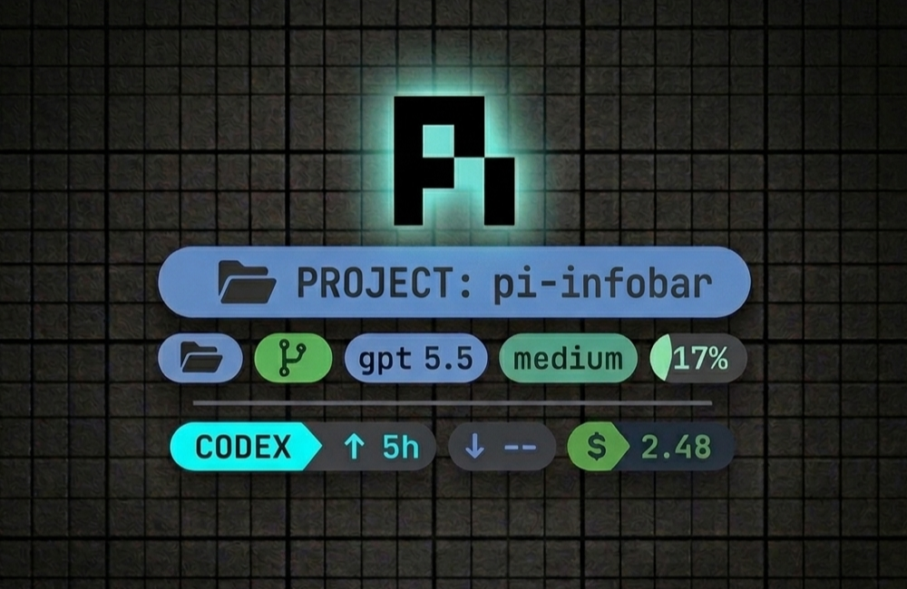

# pi-infobar - Pi Coding Agent Extension

High-contrast two-row info bar for the Pi coding agent.

This extension replaces Pi's default footer with a cleaner info bar layout inspired by a Starship-style prompt. It keeps the most important information visually dominant and avoids low-value activity labels like `status`, `idle`, or `ready`.

Requires Pi `1.0.0` or later.

## Install

```bash
pi install npm:pi-infobar
```

Try it without installing permanently:

```bash
pi -e npm:pi-infobar
```

## Layout

### Line 1 — navigation + model state

#### Left:

- current working folder, rendered first and styled as the primary segment;
- linked worktree name with `󰙅`, when the current folder is a Git worktree;
- git branch, when available, with Starship-style git status inline (`~` modified blue, `✘` untracked red, `+` staged green, `-` deleted red, `⇡/⇣` ahead/behind).

The path segment stays as the normal path. Linked worktrees get a separate green worktree segment using the worktree root folder name.

#### Right:

- active model in light blue, labeled with its provider;
- thinking level with effort-specific color.

A subtle separator sits between the two information rows.

### Line 2

#### Left: Codex and Cursor subscription usage

Cursor shows included usage remaining and time until the billing cycle resets,
matching OpenAI's format: `Cursor 91% 5d`. The countdown switches to hours or minutes
as reset approaches. Both subscriptions can appear; the active provider
comes first and takes priority on narrow terminals.

#### Right: context, token usage, finish time, and cost

- last turn finish date and time as plain local `MMM d  HH:mm`, such as `Oct 2  15:32` (or `—` before the first finish);
- context percentage with a stepped color ramp from transparent/green through yellow, orange, and red by 60%;
- plain `↑` uncached input tokens;
- plain `↓` output tokens;
- plain `R` cache-read input tokens, shown only when nonzero;
- plain `W` cache-write input tokens, shown only when nonzero;
- dark-green `$` estimated cost, including cache reads and writes.

Token counters and cost accumulate across the active session branch. For Codex
and Cursor subscriptions, `$` is an API-equivalent estimate, not a subscription charge.

The context meter refreshes immediately after compaction. While Pi reports usage
as unknown, it shows an approximate percentage such as `~3%`, estimated from the
summary, retained messages, and projected system/tool checkpoint. After the next
model response it switches back to reported usage without the `~` prefix. Failed
estimates show `?`. The estimate uses Pi's characters-per-token heuristic and
honors persisted context edits, but omits summary wrapper text and request-time
extension transformations.

## Commands

```text
/pi-infobar            toggle the info bar
/pi-infobar on         enable
/pi-infobar off        disable
/pi-infobar toggle     toggle
/codex-status          show Codex usage and rate-limit windows
/codex-status --refresh  refresh Codex usage
/codex-status --no-statusline  show report without updating footer
/codex-status --clear-statusline  clear Codex usage from footer
/cursor-status         show included, Auto/API usage, and personal on-demand spend
/cursor-status --refresh  refresh Cursor usage
/cursor-status --no-statusline  show report without updating footer
/cursor-status --clear-statusline  clear Cursor usage from footer
```

Both status commands accept `--timeout seconds` (1–120, default 15).
For `/cursor-status`, this also bounds waiting on an existing query. A waiting timeout
neither cancels the shared request nor changes its footer cache.

### Cursor authentication and refresh

Uses your existing Pi Cursor OAuth login (`/login` for Cursor). Expired credentials
are refreshed through Pi's registered Cursor provider (such as `pi-cursor`); no
Cursor desktop database or CLI credentials are read. The meter follows Cursor CLI's
authoritative included-usage percentage, falling back to included spend / limit
only when that percentage is missing. Personal on-demand spend is reported separately
by `/cursor-status`, never inferred from a team's pooled usage. Plans without usage
percentages show `usage unavailable` rather than a fabricated remaining balance.
Missing Auto/API percentages and malformed values are reported as `unavailable`,
not zero. Cursor's protobuf makes personal spend a non-optional scalar: omitting it
within a present spend-usage object means $0; a missing object means unavailable.

Usage is cached for five minutes and refreshed in the background. Failed refreshes
retry after 1/2/4/5 minutes; model-selection and session-tree events honor that deadline.
`--refresh` can bypass it. Failed usage queries, whether started by a command or in
the background, mark retained Cursor reports `stale`; commands identify cached/stale output.
Polling is rearmed if a clock rollback leaves a cache/retry deadline in the future.
Footer-updating commands share cancellation and generation guards with background
requests, so clearing, disabling,
or shutdown discards pending results. `--no-statusline` never mutates footer state.
Accounts without a Pi Cursor login don't add a chip when another provider is active.
The endpoint is an unofficial Cursor dashboard API and may change.

You can start Pi with the info bar disabled:

```bash
PI_INFOBAR=0 pi
```

---

## Implementation Details

## Structure

```
pi-infobar/
├── src/
│   ├── index.ts          ← Entry point: extension lifecycle only (~80 lines)
│   ├── types.ts          ← All shared interfaces & type aliases (~45 lines)
│   ├── theme.ts          ← COLOR palette + contextColor/thinkingColor/codexAccent (~75 lines)
│   ├── ansi.ts           ← Low-level ANSI helpers: ansi(), stripAnsi(), hexToRgb(), readableTextOn() (~55 lines)
│   ├── chips.ts          ← Chip factory + renderChip/renderChips/renderSegmentedChip (~85 lines)
│   ├── format.ts         ← Pure data formatters: formatCount, formatCost, shortenModel, etc. (~80 lines)
│   ├── git.ts            ← Git snapshot, cache, parsing, status formatting (~175 lines)
│   ├── codex-usage/      ← Codex subscription usage queries, reports, cache, and statusline manager
│   ├── cursor-usage/     ← Cursor OAuth usage query, report formatting, and independent cache
│   └── renderers.ts      ← Footer line renderers: renderPrimaryLine, renderUsageLine, etc. (~140 lines)
├── index.ts              ← Re-export barrel: `export { default } from "./src/index.js"` (~1 line)
├── package.json          ← Updated "files" list & tsconfig include
└── tsconfig.json         ← Updated include glob
```

## Code Overview

- The `COLOR` constant object
- `contextColor()` — percent → color mapping
- `thinkingColor()` — thinking level → color mapping
- `codexAccent()` — raw status string → accent color
- `codexPercentColor()` — codex percent → color

Low-level terminal rendering primitives:

- `ansi()` — apply fg/bg/bold SGR codes
- `stripAnsi()` — strip ANSI escape sequences
- `hexToRgb()` — hex string → RGB
- `rgbCode()` — RGB → SGR color code
- `readableTextOn()` — pick readable text color for a background

The chip UI component system:

- `chip()` and `plain()` factories — identical arguments and layout priorities; swap the factory in `src/renderers.ts` to switch presentation. Plain items ignore backgrounds and draw no borders or padding. You can also set `style: "plain"` or `style: "chip"` on an item.
- `renderChip()`, `renderPlain()`, `renderChips()`
- `renderSegmentedChip()`

Pure data formatting functions:

- `formatCount()`, `formatCost()`
- `shortenModel()`, `modelName()`
- `formatThinking()`
- `formatWorkingPath()`, `smartPathTruncate()`
- `shorten()`, `simplifyStatusText()`
- `formatCodexValue()`, `codexValueSegments()`
- `getTokenTotals()`

All git integration, fully self-contained:

- `gitCache`, `GIT_CACHE_TTL_MS`, `GIT_COMMAND_TIMEOUT_MS`
- `getGitSnapshot()`, `execGit()`, `getLinkedWorktreeName()`
- `parseGitStatus()`, `parseStatusBranch()`
- `formatGitStatus()`, `formatGitStatusPart()`, `isDirty()`

Footer line renderers that compose chips, git, and formatting:

- `renderPrimaryLine()`, `renderUsageLine()`, `renderSeparatorLine()`
- `fitLeftRight()`
- `renderPathCluster()`, `renderPathChip()`, `renderFittedPathChip()`
- `renderBranchChip()`, `renderWorktreeChip()`
- `renderCodexStatus()`

The main extension entry point — only lifecycle & event wiring:

- `piInfobar()` default export
- `installFooter()`, `refresh()`
- Event handlers: `session_start`, `session_tree`, `session_shutdown`, `session_compact`, `model_select`, `agent_end`, `turn_end`, `thinking_level_select`
- Command handlers: `pi-infobar`, `codex-status`, `cursor-status`

---
